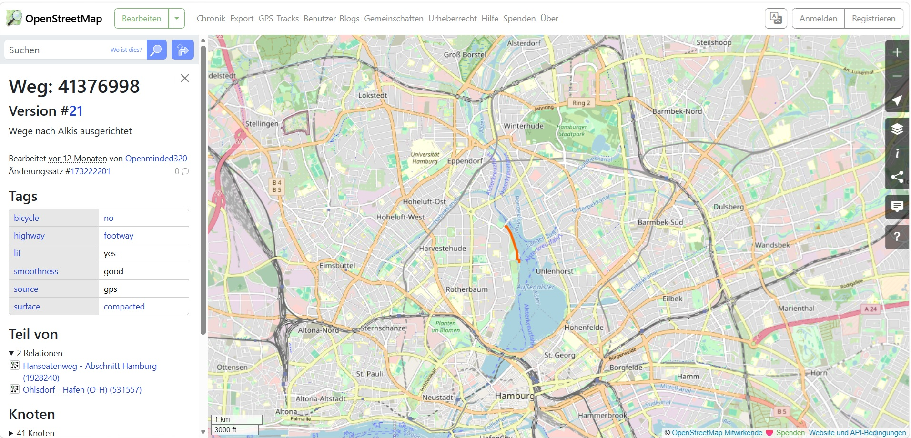
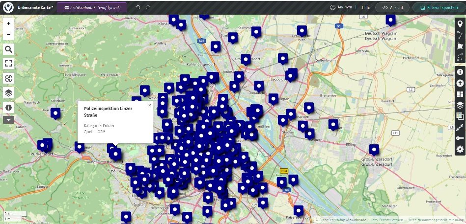

# exploreGeoStructures
Ein KI Assistent, der nach besonderen geographischen Strukturen und Bewegungsmustern sucht, die sich für Spiele wie Schnitzeljagd gut eignen.

# Projekt

* `tasks` - Hier untersuchen wir neue tasks, entwickeln und verbessern die Strategie
* `tasks/Fussweg` - Sucht nach einem Fußweg, der spezielle Anforderungen erfüllt
* `tasks/belebteOrte` - sucht nach Orten in einer Stadt, die an gewissen Tagen/Stunden besonders belebt sind
* `tasks/ÖPNVRundfahrt` - stellt eine Reise als Abfolge von öffentlichen Verkehrsmitteln zusammen, die gewisse Anforderungen erfüllt. Das Ergebnis wird in einer Karte dargestellt.
* `AGENTS.md` - zentrale Anweisungen (Nutzung python venv, Visualisierung auf Karten mittel kml-files für openstreetmap, ...)
* `.opencode/skills` - hier sind skills definiert, die einen gewissen Reifegrad haben. Mit "/skill" kann man sie anschauen
und mit "@" einen einzelnen Skill benutzen
* `.opencode/skills/behoerdenetc` - sucht nach Behörden, Botschaften etc. in einer Stadt oder einem Stadtteil

# Beispiele

## Ein einsamer Fußweg in Hamburg

## Die belebtesten Orte im Bezirk Pankow dienstag vormittags

## Behörden, Botschaften & Co. in Wien

